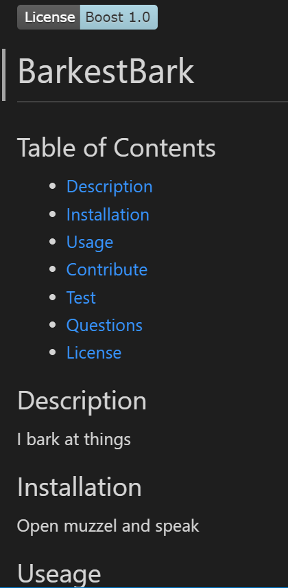

# Readme-Generator

## Description

This program generates a readme.md file. Using node js I ask questions via some prompts on the cmd line. Based off the response I fill a readme file with the relevant information.

Here is a link to a video as I walk through the steps :



I stored the questions in an array, but the interesting bit was the list of options I present for the license. In this section I needed to declare the type as a list, and store an array of choices. This allows the user to move up and down the list via the arrow eyes.

```javascript
{
        type: 'list',
        name: 'license',
        message: 'Which license are you using?',
        choices: [
            'Apache 2.0',
            "GNU v3.0",
            "MIT",
            "BSD 2-Clause",
            "Boost Software 1.0",
            "Creative Commons Zero v1",
            "Eclipse Public License",
            "BSD 3-New",
            "GNU Affero",
            "GNU General",
            "GNU Lesser",
            "Mozilla",
            "The Unlicense"],
        inital: 1}
```
In the code snippet below I use the response I got from the prompts to fill in the readme file. I use template literals to fill out the content on the page then returned this back to be written to a file name "GENERATED-README.md". 

```javascript
  return `
  ${renderLicenseBadge(data.license)}
  # ${data.title}
  ...
  ${data.description}
  ## Installation
  ${data.install}
  ## Useage
  ${data.useage}
  ## Contribute
  ${data.contribute}
  ## Test
  ${data.test}
  ## Questions
  Github repo: [!${data.github}](https://github.com/${data.github}?tab=repositories)\n
  If you have any questions, 
  email: ${data.email} \n
  linkedin: ${data.linkedin}
....
`
```

## Installation

Install npm via "npm init". Then you will need to install inquirer by using "npm i inquirer@8.2.4". A folder called node_modules will generate which means you are on the right track. Open your terminal to the js folder. Once you are there run the index.js with node, i.e "node index.js". The prompt will begin and after you fill it out and file name "GENERATED-README.md" will show up in the js folder.

[Github Repo](https://github.com/johnfrom209/readme-generator)

[Youtube Video](https://youtu.be/SQtkhmBTXig)

## Usage

Once you install the correct components you will be asked to a series of questions. Enter "node index.js" in the cmd line once you are in the js directory folder. The prompt will begin and after you fill it out and file name "GENERATED-README.md" will show up in the js folder.

## Credits

Uses Node js, inquirer, UCB coding bootcamp provided starter code.

## Contact Me

[Linkedin](https://www.linkedin.com/in/johnfrom209/)

[View my Github Repo](https://github.com/johnfrom209)

## License

Refer to the license in the Github repo.